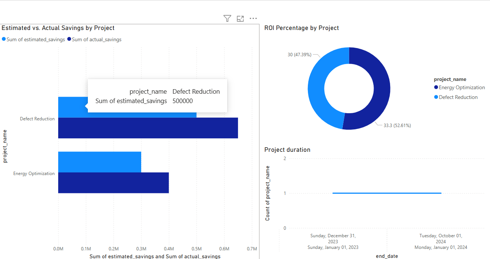

# 📊 Predictive Maintenance in Chemical Engineering – BI Integration

A full-stack data science & business intelligence project that models cost savings, ROI, and KPI impacts using a MySQL database (3NF), Power BI dashboarding, and real-world engineering scenarios.

---

## 🛠️ Technologies
- MySQL Workbench
- Power BI
- CSV · SQL · Data Modeling

---

## 📂 Includes
- Normalized relational schema
- Data engineering DDL scripts
- Sample data & .csv
- Dashboard visuals
- Gamma App & GitHub Pages–ready setup

---

## 📊 Dashboard Preview

---

## 🧠 Dashboard Insights

### 1️⃣ Estimated vs. Actual Savings
- **Defect Reduction** exceeded expectations with $150K more than estimated.
- **Energy Optimization** also outperformed with $100K in additional gains.

📌 _This insight supports funding toward high-yield project categories and validates forecasting methods._

### 2️⃣ ROI Percentage by Project
- Energy Optimization: **33.3%**
- Defect Reduction: **30%**

📌 _Both projects outpaced industry ROI benchmarks (~15–20%), empowering executive buy-in for similar initiatives._

### 3️⃣ Project Duration
- Projects span fiscal 2023–2024, aligning with strategic planning cycles.

📌 _Use this to better manage manpower, quarterly KPIs, and outcome predictability._

---

## 📥 Download the Power BI File

[Download Predictive Maintenance Dashboard (.pbix)](./predictive%20maintenance%20Dashboard.pbix)

---

✅ **Analyze efficiency. Visualize ROI. Drive decisions.**

#zabatissuquality #stilldoinit #BIinAction #PredictiveMaintenance #DataDrivenROI

   

### 🧠 Download the Interactive Power BI Report

📥 [Download Predictive Maintenance Dashboard (.pbix)](./predictive_maintenance_Dashboard.pbix)

